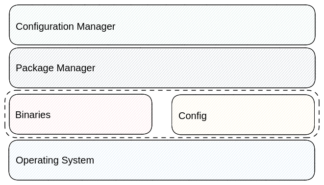
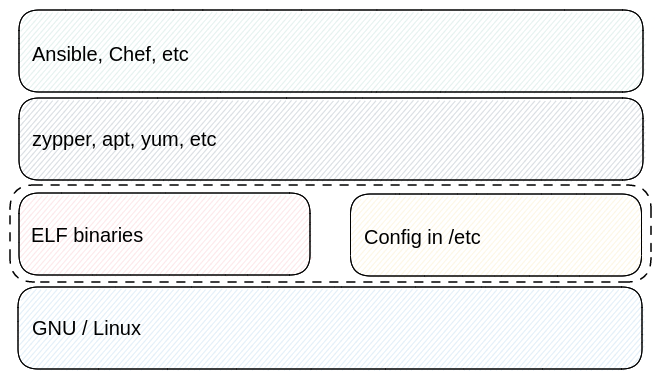
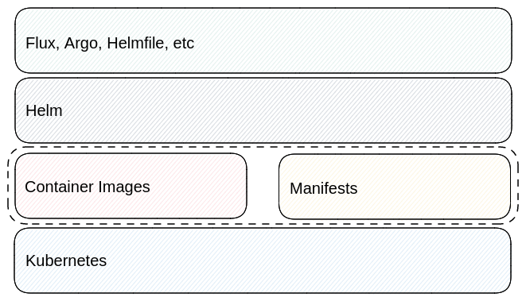

# Helm and Ecosystem

Packages and package managers are not the final solution when you need infrastructure management. This is why there are tools like Terraform and Ansible that use RPMs and Debian Packages along with the package managers that work with these package types.

Helm is a package manager. It's not a template engine. And, it's not a full workload management or workload management solution. There are separate concerns and Helm is focused on the concern of being a package manager.

When maintaining Helm it's important to consider the user roles and stack it will be used within. Helm is used stand alone and in various stacks. Any changes need to consider the impact on the components around Helm.

Considering various stacks is important because there is no one right way to do workload or configuration management. Even when we have our opinions there are those who have different ones. Those can be worked out at a different level in the stack while all parties can use package management, if they need it.

## The Ecosystem Around Helm

To illustrate this let's look at a model for visualizing a stack around configuration management.

### The Model

_Figure 1: A structure for looking at a configuration management stack._

In the stack from Figure 1 you can see the operating system at the bottom. This can be a OS in a traditional sense or a modern platform. It depends on the level you view the system. Above that you have the configuration and workloads. Those are often times installed and managed using the appropriate package manager for the operating system. Then, above all of that, you have a configuration management tool that ensures the right configuration is being applied in that environment.

To illustrate this, let's look at traditional server management.

### GNU / Linux

_Figure 2: The configuration management structure applied to GNU/Linux._

In implementation illustrated in Figure 2 of the model we can see:

- **OS**: We have a GNU / Linux operating system at the bottom. This is important because the binaries in use are tied to the operating system.
- **Binaries**: in this case we have ELF binaries which are the appropriate ones to run on Linux
- **Config**: is primarily looking at configuration files in `/etc`.
- **Package Manager**: there are various package managers for the different Linux distributions. This would be the appropriate one for the operating system.
- **Configuration Manager**: There are various config managers that do things in different ways. Some are push based while some are pull based.

GNU/Linux serves helps illustrate the model. But, we need to apply it to Helm and Kubernetes.

### Helm / Kubernetes

_Figure 3: The configuration management structure applied to Helm and Kubernetes._

Figure 3 showcases the configuration management ideas applied to Kubernetes. In this case you have Kubernetes on the bottom, the binaries are container images and the configuration is manifests, Helm is the package manager, and there are many tools that can be used for configuration management.

There are two ways this impacts Helm and the maintainers.

1. There are different configuration management tools that use different models. Helm does not take a stance on the right way and, instead, tries to make it possible for all of the different approaches to use Helm. Configuration management is simply a different concern for other tools to implement.
2. Where we have container images in this diagram it would be possible to have virtual machines, web assembly (WASM), and other formats thanks to extensions to Kubernetes.

Since Helm focuses on being a package manager that can be used alone or in a stack, the parts around it can move, innovate, and go in contradictory directions.

Helm is just one slice in the stack. Helm maintainers need to make sure it doesn't creep into the other areas.
